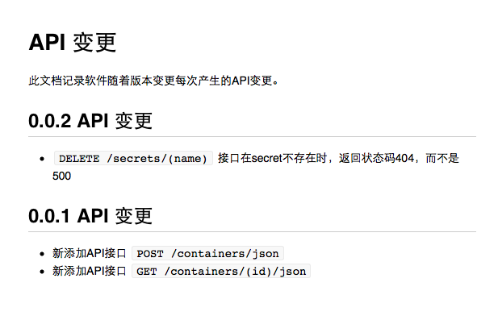

# API 文档规范

一个项目的 API 文档，对外可以帮助用户更好地了解软件的接口，对内可以帮助研发更好的做好协作。

目前 DaoCloud 软件项目的 API 文档包含两部分内容： 

* API 接口定义文档；
* API 变更文档。

## API 接口定义文档

dao-style-vue 项目的 API 接口定义文档可以见 [示例文档](../docs/README.md)。

## API 变更文档

API 变更文档有能力帮助用户了解到软件不同版本之间的 API 差异。清晰同一软件不同版本之间的 API 差异，对于用户的软件升级，无疑会带来巨大的帮助，比如：了解软件版本之间的差别，降低因为API变更带来的软件风险等。

API 变更文档记录项目每一个 API 版本带来的 API 变更。每一个 API 版本变更中应该包含：

* 在这个 API 版本中，修改的 API 接口；
* 在这个 API 版本中，新增的 API 接口；
* 在这个 API 版本中，删除的 API 接口。

API 变更文档的示例见下图：

