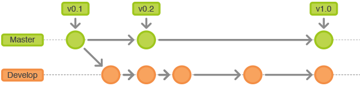
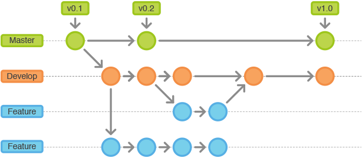
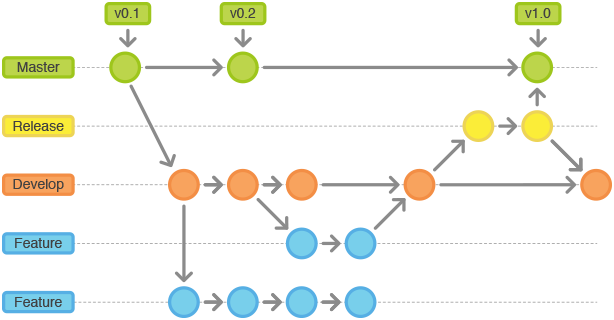
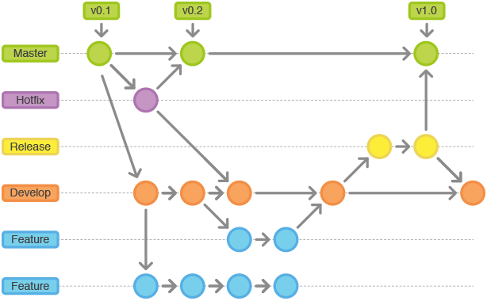

# Git Flow 代码管理流程与规范

越来越多的企业、组织与个人开始使用Git协议，来帮助完成项目的版本管理、代码协作。

纵使Git有诸多优点，然而项目在面对版本管理时，仍然有非常大的挑战。绝大多数的挑战来源于：Git流程的多种多样，Git规范的不统一，项目参与人员的Git使用习惯差异大等。

具体而言，所有协作者工作在同一代码仓库上，有可能遇到一下问题和挑战：

* 如何开始一个功能特性Feature的开发，而不影响别的Feature？
* 由于很容易创建新分支，分支多了如何管理，时间久了，如何知道每个分支是干什么的？
* 哪些分支已经合并回了主干？
* 如何进行Release的管理？开始一个Release的时候如何冻结Feature, 如何在Prepare Release的时候，开发人员可以继续开发新的功能？
* 线上代码出Bug了，如何快速修复？而且修复的代码要包含到开发人员的分支以及下一个Release?

## Git Flow

DaoCloud 推荐使用Git Flow的规范流程来管理项目的版本管理、代码协作。

## Git Flow 常用分支

Git Flow 在管理过程中一般拥有5类常用分支：

* **master分支，又名production分支**：这是我们常用的master分支，只有这个分支的代码才会发布到生产环境。注意，这个分支只能从其他分支合并，工程师不能再这个分支直接修改；

* **develop分支**：这是我们的主开发分支，工程师所有的功能性开发都会基于develop分支。develop分支包含所有要发布到下一个release的代码。这个分支有以下特性：不主动向其他分支合入代码；作为feature分支的源分支，最终接受feature分支的代码合入；作为release分支的源分支，接受最终release分支的合入；

* **feature分支**：这是工程师用来开发一个新功能的分支，一旦开发完成，Maintainer将其合入develop分支，从而将这些功能准备进入下一个release。**注意：一旦feature分支合入develop分支，Maintainer应立即删除该feature分支；** 

* **release分支**：当develop分支发展到一定阶段，我们需要发布一个release分支时，Maintainer需要基于develop分支，创建相应的release分支。完成release分支之后，Maintainer需要将release分支同时合入master分支以及合回develop分支（合入master分支之后，立即完成master分支的tag操作，最终maintainer删除release分支）；

* **hotfix分支**：只有当master分支上出现bug时，我们会采用hotfix分支。hotfix分支源于master分支，完成bug修复之后，同时合入master分支以及develop分支，**注意: hotfix合入master分支之后，额外立即完成master分支的tag操作**。

## Git Flow 如何工作
	
### 1. 初始master分支和develop分支

第一个分支来源于master分支。所有来到master分支的commit都应该被打tag。因此，不论是**release分支合入master分支**，还是**hotfix分支合入master分支**，都应该在当前的commit号上打tag。develop分支来源于master分支。Master的初始情况如下图：

### 2. 正常开发使用feature分支

feature分支命名形式为 feature/* 。

日常的功能代码贡献都通过feature 分支来完成。每当工程师开发完feature分支，需要完成两个步骤：

* 必须将feature分支merge回develop分支；
* 合并完分支之后**务必将该feature分支删除**。

feature分支的示意图如下：

### 3. 发布版本所用的release分支

release分支名为 release/* 。

release分支基于develop分支创建。创建release分支之后，工程师可以在这个release分支上完成测试，修复bug等。如果此时，其他的开发工程师需要开发新的功能，则依旧可以基于develop分支创建feature分支开发新的功能。**注意：一旦打了release分支之后，请勿从develop分支上合并新的代码改动到release分支。**

release分支正式完成之后，需要发布release分支，此时需要完成三个步骤：

* 将release分支合入master分支，并在master分支上打好release的版本Tag号；
* 将release分支合入develop分支，将release分支上修改的bug回归开发分支develop；
* 删除release分支，分支内容已经由tag号记录。

release分支的示意图如下：

### 4. hotfix维护分支

hotfix分支名为 hotfix/* 。

由于生产环境发布的版本都是基于master分支的，而master分支的代码依然有可能出现bug，此时代码管理需要针对master分支做hotfix操作。hotfix分支基于master分支来创建，开发完毕之后，需要完成三个步骤：

* 将hotfix分支合入master分支，完成master分支上的Tag操作；
* 将hotfix分支合入develop分支；
* 删除hotfix分支，分支内容已经由tag号记录。

hotfix分支的示意图如下：

