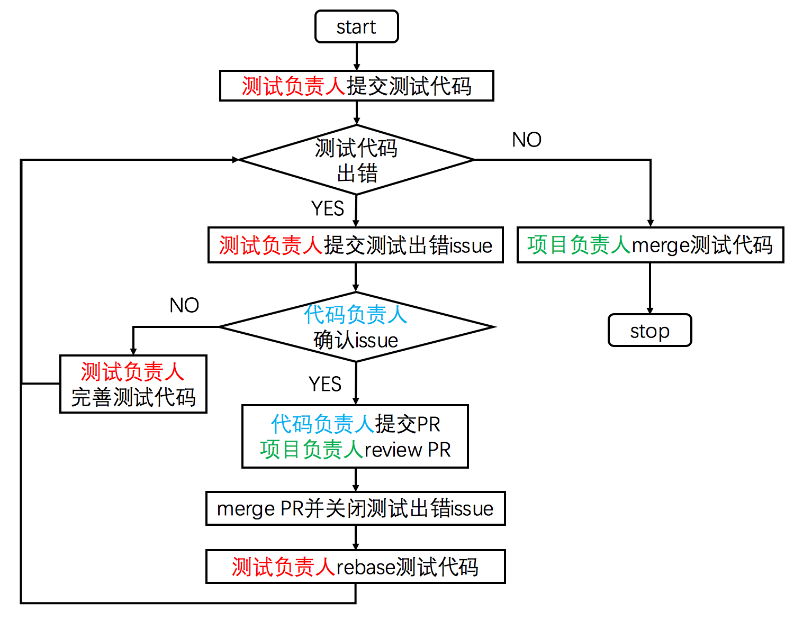

# 测试协作流程

交付一个好的软件，势必需要保障软件的质量；软件质量的保障，离不开测试代码的支撑。原则上，DaoCloud 的所有代码项目，均必须通过测试。DaoCloud 亦鼓励每一个研发工程师，针对自身编写或者更新的代码，有计划有组织地进行测试案例的编写。

## 项目测试协作流程图

测试代码对于项目的重要性不言而喻，负责编写测试的工程师，需要以明确清晰的方式与项目的其他参与者进行协作。协作过程需要按照以下流程图：

